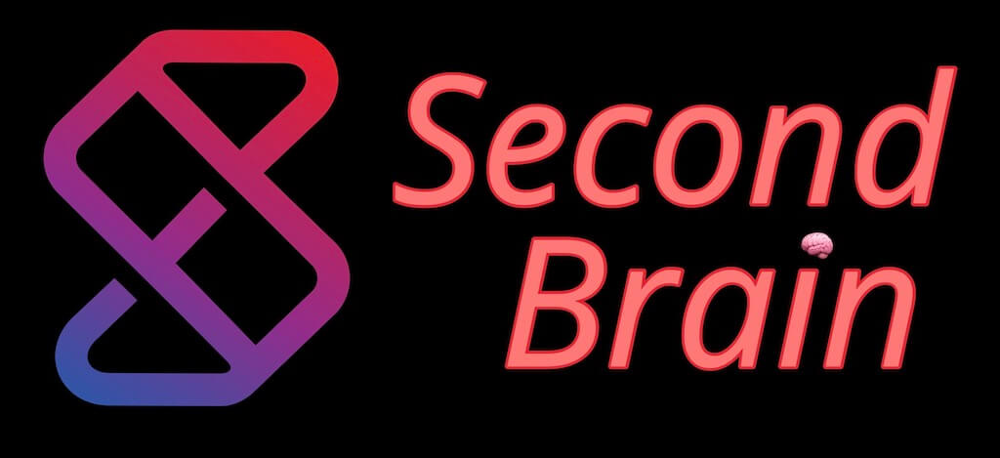

### Hi there 👋

I'm Simon, a dad and family person who has [pivoted](https://youtu.be/dNASkBuhPy0) into Technical Writing and has been working in the field of Data Engineering for over 20 years. I love using my skills to make a positive impact on the world around me.

One of my passions is writing, and I'm the author of [sspaeti.com](https://sspaeti.com), the #1 ranked blog on Google for Data Engineering. I've also written for publications such as Towards Data Science, freeCodeCamp, and Hackernoon, and have been recognized as one of the top writers in my field on Quora since 2020. Recently, I was even mentioned as a top 25 Influencer and content creator on Databand.

One of my contributions to the field is the creation of the [Data Glossary](https://glossary.airbyte.com). It's a connected knowledge hub that uses backlinks and interactive graphs to help users learn in a connected way. Unlike traditional approaches, it allows users to dive deeper and explore topics in a more meaningful way.

I'm always excited to learn about new open-source technologies, and I use an extensive [Personal Knowledge Management Workflow](https://www.sspaeti.com/blog/pkm-workflow-for-a-deeper-life/) to capture, organize, and share my knowledge with others. Recently, I created my [Public Second Brain](https://brain.sspaeti.com/), which is an extension of my workflow and helps me to lead a deeper life.

If you'd like to learn more about me, please check out my [Pathless Path](https://www.sspaeti.com/blog/finding-my-pathless-path/), [Now Page](https://now.sspaeti.com), or [GitHub](https://github.sspaeti.com), where you can find my latest updates and projects. Thanks for stopping by!

- 💬 Ask me about data engineering, open-source, PKM, Second Brain, (neo)vim.
- 😄 Pronouns: he/him
- 🗣 Socias: [LinkedIn](https://www.linkedin.com/in/sspaeti/) or [Twitter](https://twitter.com/sspaeti)

<!-- Does not include sspaeti-com organization where all my stars are :)

 
  
  

Here are some ideas to get you started:

- 🔭 I’m currently working on see on my [Now Page](https://www.sspaeti.com/now/).
- 🌱 I’m currently learning see on my [Now Page](https://www.sspaeti.com/now/).
- 👯 I am a [top viewed writer](https://www.quora.com/topic/Data-Engineering/writers) at Quora. 
- 🤔 I’m looking for help with ...
- 📫 How to reach me: ...
- 😄 Pronouns: he/him
- ⚡ Fun fact: ...
-->
